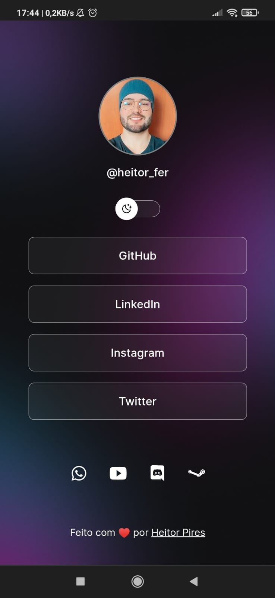
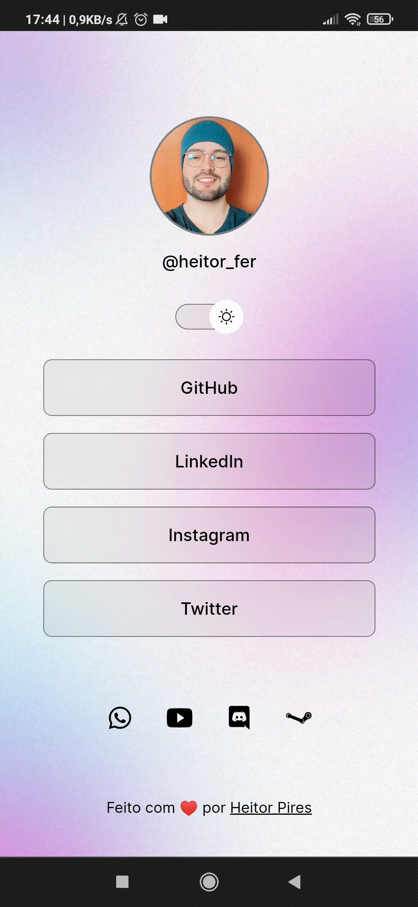
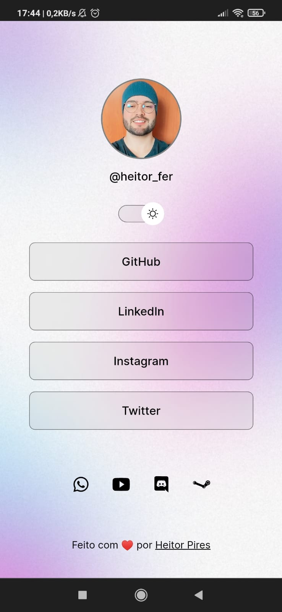

  DEV-LINKS

  
  
  

 

## Como Executar

- 1 - Clone o repositório.
- 2 - Instale as dependências com npm install.
- 3 - Execute o comando npm start.
- 4 - Abra o navegador em http://localhost:3000.

 
 

## Créditos

Este projeto foi inspirado e criado a partir de aulas de html e css.

- ♥ [Rocketseat](https://app.rocketseat.com.br/devlinks)
- ♥ [Mayk Brito]([`@maykbrito`](https://github.com/maykbrito)) 
